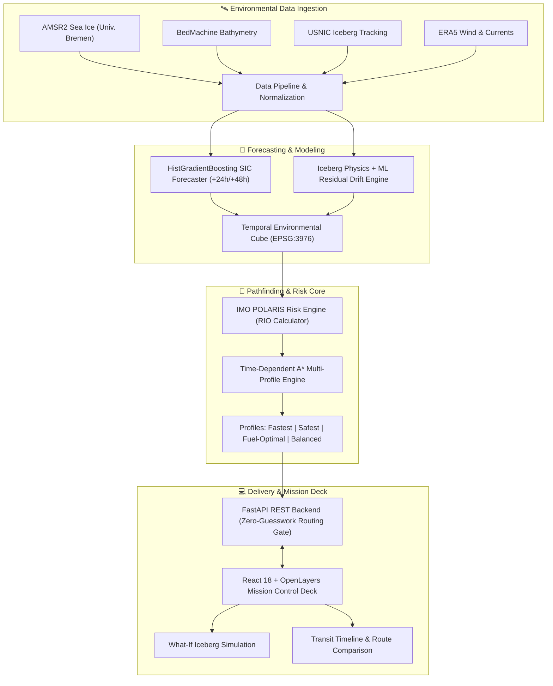

# 🧊 Antarctic Mission Control (polar-nav)

<div align="center">

[](https://www.sih.gov.in/)
[](https://www.python.org/)
[](https://fastapi.tiangolo.com/)
[](https://react.dev/)
[](https://www.typescriptlang.org/)
[](https://vitejs.dev/)
[](https://epsg.io/3976)
[](#polaris-rio-risk-framework)
[](#testing--verification)

<br/>

**Autonomous Risk-Aware Polar Routing, ML Sea-Ice Forecasting, and Decision Support Mission Deck for the Southern Ocean**

[Explore Features](#-key-features) •
[System Architecture](#-system-architecture) •
[Quickstart](#-quickstart-guide) •
[Routing Profiles](#-routing-profiles--polaris-compliance) •
[API Reference](#-api-endpoints)

---

</div>

## 📌 Overview

**Antarctic Mission Control (`polar-nav`)** is an operational decision-support platform designed for polar scientific vessels navigating the Southern Ocean and Antarctic marginal ice zones. Developed for **SIH26059**, this system bridges the gap between high-latency satellite observations, machine-learned sea-ice dynamics, hydrodynamic iceberg drift physics, and safety-critical vessel navigation under the **IMO Polar Code (POLARIS)**.

Navigating polar waters demands balance between hull-ice structural capabilities, transit time, and fuel economy. Rather than treating routes as static paths, `polar-nav` treats navigation as a dynamic time-dependent problem on an **EPSG:3976** Antarctic polar stereographic grid (6,250 m cell resolution), combining:

- **Mathematical Optimization**: Time-dependent A* (Time-A\*) pathfinding across multi-temporal raster cubes.
- **IMO POLARIS RIO Enforcement**: Calculating Risk Index Outcomes based on vessel ice class (`PC4`, `PC5`, etc.) to prevent structural compromise.
- **Hybrid Machine Learning & Physics**: Gradient boosted regressor (`HistGradientBoostingRegressor`) for +24 h / +48 h sea-ice concentration (SIC) predictions alongside ocean-current/wind physics with ML residual corrections for iceberg drift.
- **Mission Control Command Deck**: Interactive React/OpenLayers dashboard supporting multi-destination evaluation, transit timelines, and "what-if" obstacle simulation.

---

## ✨ Key Features

| Capability | Description |
| :--- | :--- |
| **🧭 Multi-Objective Route Profiles** | Generates and compares **Fastest**, **Safest**, **Fuel-Optimal**, and **Balanced** trajectories, evaluating speed penalty, fuel burn, and ice hazards. |
| **🛡️ POLARIS RIO Risk Framework** | Implements the International Maritime Organization (IMO) Polar Operational Limit Assessment Risk Indexing System for ice classes, flagging elevated risk and unnavigable cells. |
| **🤖 Hybrid Forecast Engine** | Combines physical ocean/wind advection with machine-learning residuals to predict sea-ice evolution and track iceberg drift uncertainty ellipses. |
| **🛰️ Multi-Source Ingestion** | Ingests daily **AMSR2 SIC** (University of Bremen), **BedMachine Antarctica** bathymetry, **USNIC** tracked icebergs, and **ERA5** atmospheric reanalysis. |
| **🕹️ Interactive Simulation Deck** | Allows operators to drop simulated icebergs directly onto the Antarctic map to observe dynamic re-routing and cost penalties in real time. |
| **⏱️ Transit Control & Timeline** | Scrub across 6-hour forecast and exposure horizons to inspect conditions at the exact predicted vessel arrival time. |
| **🔍 Cell & Route Inspector** | Click any point on the Antarctic polar grid to view coordinates, raw SIC %, bathymetry depth, RIO score, and fuel burn coefficient. |

---

## 🏛️ System Architecture



---

## 📂 Project Structure

```text
antarctic-mission-control/
├── configs/                       # Grid declarations, observed sensor metadata & projection specs
├── docs/                          # In-depth architectural, temporal gap & forecast documentation
├── frontend/                      # Interactive Mission Control Command Deck
│   ├── public/                    # GeoTIFF/PNG overlay tiles & manifest
│   ├── src/
│   │   ├── api/                   # Typed API client, route equivalence & provenance engines
│   │   ├── components/            # Mission drawer, transit controls, cell inspector, deck states
│   │   ├── map/                   # OpenLayers polar stereographic (EPSG:3976) rendering
│   │   └── App.tsx                # Main mission deck control hub
│   └── package.json               # Frontend dependencies (React 18, Vite, OpenLayers, Proj4)
├── logs/                          # Verification logs, training metrics & backtest histories
├── src/                           # Backend Core Packages
│   ├── api/                       # FastAPI application, route gateways & simulation handlers
│   │   ├── main.py                # REST API entrypoint & middleware
│   │   ├── mission_decision.py    # Multi-destination multi-departure evaluation
│   │   ├── environment_timeline.py# Multi-bucket temporal raster provider
│   │   └── simulate.py            # Simulated iceberg injection & cost penalty analysis
│   ├── evaluation/                # Hindcasting & historical forecast decision evaluation
│   ├── models/                    # ML & Physics models
│   │   ├── train_forecast_model.py# HistGradientBoostingRegressor training pipeline
│   │   ├── forecast_sic_raster.py # Lead-time raster prediction generator
│   │   ├── iceberg_physics.py     # Hydrodynamic & atmospheric advection
│   │   └── iceberg_ml_residual.py # Machine-learned residual drift corrections
│   └── routing/                   # Mission routing & safety engines
│       ├── polaris.py             # IMO POLARIS RIO risk calculation
│       ├── time_astar.py          # Time-varying A* grid pathfinder
│       ├── fuel_cost.py           # Engine load & speed-through-ice fuel model
│       └── route_profiles.py      # Multi-objective profile comparison generator
├── tests/                         # 27+ comprehensive test suites (Pytest & Vitest)
├── requirements.txt               # Backend Python dependencies
└── run_forecast_training_mac.sh   # Automated gated pipeline for model training
```

---

## 🚀 Quickstart Guide

### 1. Prerequisites
- **Python**: `>= 3.10` (tested with 3.10 and 3.11)
- **Node.js**: `>= 18.0.0` and **npm**
- **GDAL / Proj**: Bundled via rasterio and pyproj

---

### 2. Backend Setup

```bash
# Clone the repository
git clone https://github.com/Vihgzzz920/antarctic-mission-control.git
cd antarctic-mission-control

# Create and activate virtual environment
python -m venv .venv

# On Linux / macOS:
source .venv/bin/activate
# On Windows (PowerShell):
.venv\Scripts\Activate.ps1

# Install dependencies
pip install -r requirements.txt
```

Launch the FastAPI backend:
```bash
uvicorn src.api.main:app --reload --port 8000
```
> The API will be live at `http://localhost:8000`. Interactive OpenAPI documentation is available at `http://localhost:8000/docs`.

---

### 3. Frontend Setup

In a separate terminal window:
```bash
cd frontend

# Install dependencies
npm install

# Start Vite development server
npm run dev
```
> Open your browser at `http://localhost:5173` to explore the **Antarctic Mission Control Deck**.

---

### 4. Running Offline with Synthetic Fixtures

No network access or satellite archive download? Use the included synthetic data fixture:

```bash
# Generate synthetic Antarctic SIC GeoTIFF
python make_test_fixture.py

# Inspect the generated fixture
python -m src.data.inspect_sic data/raw/sic_TESTFIXTURE.tif
```

---

## 🛡️ POLARIS RIO Risk Framework

The International Maritime Organization (IMO) Polar Code defines the **Polar Operational Limit Assessment Risk Indexing System (POLARIS)**. In `polar-nav`, safety constraints are determined by the Risk Index Outcome (RIO):

$$\text{RIO} = \sum_{i} \left( C_i \times \text{RV}_{i} \right)$$

where:
- $C_i$ is the concentration of ice type $i$ (in tenths).
- $\text{RV}_i$ is the Risk Value for ice type $i$, dependent on the vessel's Polar Class (`PC1` through `PC7`).

| RIO Value | Operating Category | System Action |
| :---: | :---: | :---: |
| **$\text{RIO} \ge 0$** | **Normal Operation** | Unrestricted navigation at standard profile speeds |
| **$-10 \le \text{RIO} < 0$** | **Elevated Risk** | Navigable with speed penalties and fuel burn adjustments |
| **$\text{RIO} < -10$** | **Restricted / Unsafe** | Hard barrier; cell is impenetrable for the vessel ice class |

---

## 🧭 Routing Profiles & Multi-Objective Trade-Offs

When an operator requests an evaluation between Antarctic base stations or coordinates, `polar-nav` computes four distinct Pareto profiles:

```
                      ▲ Safety / Risk Avoidance
                      │
                      │        [SAFEST]
                      │           ●
                      │
                      │                [BALANCED]
                      │                     ●
                      │
                      │  [FUEL-OPTIMAL]
                      │        ●
                      │                          [FASTEST]
                      │                              ●
                      └───────────────────────────────────► Transit Speed
```

1. **🚀 Fastest**: Minimizes total transit hours; accepts higher ice resistance and higher fuel expenditure when safely permissible ($\text{RIO} \ge 0$).
2. **🛡️ Safest**: Maximizes minimum encountered RIO score, prioritizing wide berths around multi-year ice floes and iceberg concentration fields.
3. **⛽ Fuel-Optimal**: Optimizes hydrodynamic resistance, ice-breaking power demands, and detour distance to minimize metric tonnes of marine fuel.
4. **⚖️ Balanced**: Multi-objective compromise applying weighted penalties for delays, structural stress, and consumption.

---

## 📡 API Endpoints

| Method | Endpoint | Description |
| :--- | :--- | :--- |
| `GET` | `/api/health` | Healthcheck returning backend status, CRS projection, and active grid info. |
| `POST` | `/api/mission/evaluate` | Evaluates multi-profile routes across candidate destination sites and departure horizons. |
| `POST` | `/api/simulation/iceberg` | Injects a simulated iceberg at $(x, y)$ projected coordinates and computes route deviation costs. |
| `GET` | `/api/forecast/sic` | Retrieves predicted sea-ice concentration rasters (+24 h / +48 h) for a specified origin date. |
| `GET` | `/api/icebergs/exposure` | Returns dynamic iceberg exposure fields for requested 6 h or 12 h transit buckets. |
| `GET` | `/api/evaluation/historical` | Retrieves historical backtesting comparisons against baseline persistence models. |

---

## 🧪 Testing & Verification

The repository contains 27+ Python test suites verifying mathematical accuracy, grid bounds, coordinate conversions, and regression stability:

```bash
# Run backend test suite
pytest tests/ -v

# Run individual routing validation
python tests/test_end_to_end_route.py
python tests/test_polaris_risk.py

# Run frontend tests
cd frontend
npm run test
```

---

## 📚 Acknowledgments & Data Sources

- **AMSR2 Sea Ice Concentration**: [University of Bremen Institute of Environmental Physics (IUP)](https://seaice.uni-bremen.de/)
- **Iceberg Tracking**: [U.S. National Ice Center (USNIC)](https://usicecenter.gov/)
- **Bathymetry & Topography**: [BedMachine Antarctica (NSIDC / Morlighem et al.)](https://nsidc.org/)
- **Polar Code Guidance**: [International Maritime Organization (IMO) MSC.1/Circ.1519](https://www.imo.org/)
- **Atmospheric Data**: [ECMWF ERA5 Reanalysis](https://www.ecmwf.int/en/forecasts/dataset/ecmwf-reanalysis-v5)

---

<div align="center">
  <sub>Developed for Smart India Hackathon (SIH26059) • Decision Support Prototype</sub>
</div>
